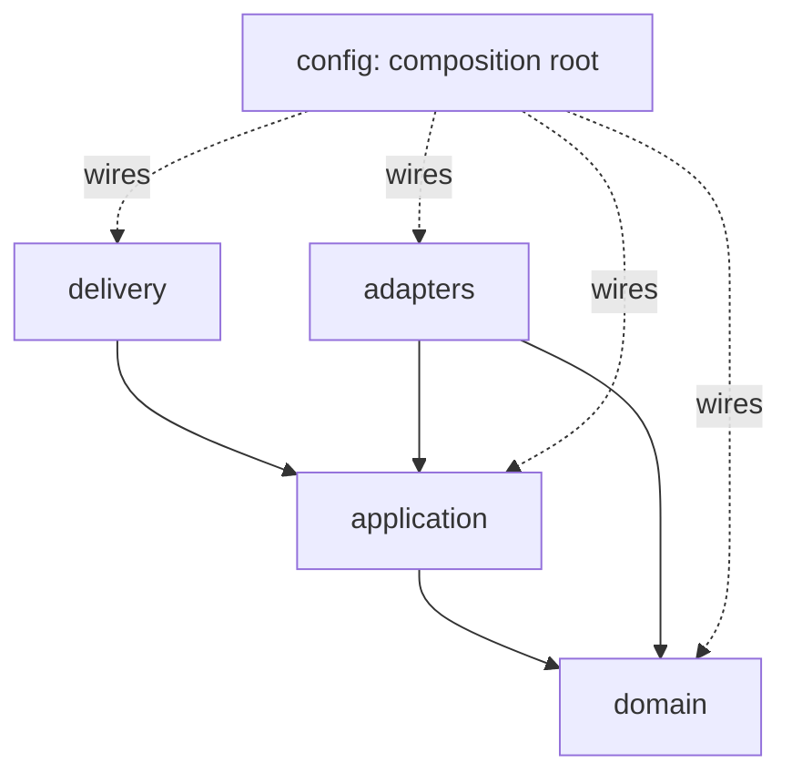

# Backend Architecture

A concise, code-facing summary of how the backend is structured. The authoritative, exhaustive version
is the [Backend Implementation Guide](../docs/Backend_Implementation_Guide.md); the system-level design is
[docs/Architecture.md](../docs/Architecture.md). This file is what a contributor reads before touching a
package.

## Layers (Clean/Hexagonal — ADR-0001)

```
delivery/  ─┐  (HTTP, workers, scheduler, ops)   framework-facing, inbound
adapters/  ─┤  (providers, persistence, cache,    implement application ports (all I/O lives here)
            │   eventbus, secrets, identity, embeddings)
application/─┤ (use-cases, PORTS, DTOs, UoW)       orchestration; no I/O impls
domain/    ─┘  (entities, value objects, services) pure business core; no frameworks
config/       (settings + DI container)            composition root — wires everything
shared/       (typed primitives)                   leaf; no business logic
```

**The Dependency Rule:** imports point **inward** — `delivery → application → domain`; `adapters →
application(ports) + domain`. `domain` imports nothing but `shared`/stdlib. `config` is the only package
that imports outward (to assemble the graph). Enforced by **import-linter** in CI.



## Ports & adapters (the seams)
Interfaces live in `application/ports`; concrete implementations in `adapters/`. Names mirror the
[C4 code diagram](../docs/architecture/C4/04-code.md):

| Port | Adapter examples | ADR |
|------|------------------|-----|
| `LLMProviderPort` | `OpenAIAdapter`, `AnthropicAdapter`, `GenericOpenAICompatibleAdapter` | 0003 |
| `RoutingStrategyPort` | `LowestCostStrategy`, `WeightedStrategy` … | 0012 |
| `BudgetPort` | `RedisLuaBudgetAdapter` | 0004 |
| `CachePort` | `RedisExactCacheAdapter`, `PgVectorSemanticAdapter` | 0006 |
| `EmbeddingPort` | `LocalEmbeddingAdapter`, `ExternalEmbeddingAdapter` | 0007 |
| `EventBusPort` | `RedisStreamsAdapter`, `KafkaAdapter` | 0005 |
| `AuthorizationPort` | RBAC decision function | 0008 |
| `SecretsPort` | `KmsSecretsAdapter`, `VaultSecretsAdapter` | 0011 |
| `UnitOfWork` + `*Repository` | SQLAlchemy Core impls (RLS-scoped) | 0002 |

Business code depends on the **left column**; `config/container.py` binds the right column per profile.

## Request lifecycle (inference hot path)
`HTTP → middleware pipeline (ctx, security, authn, tenant, authz, rate-limit, idempotency) → inference
use-case → [governance → budget.reserve → cache → routing → provider] → response → publish usage event
(async)`. Transactions are short; **no provider call inside a DB transaction**; metering is async
(ADR-0004/0005). Sequence: [01-inference-cache-miss](../docs/architecture/sequence/01-inference-cache-miss.md).

## Processes (one image, three roles)
`api` (ASGI), `worker` (EventBus consumers), `scheduler` (reconciler/resets/partitions/probes). All
stateless, built from one image, selected by `config/bootstrap.py`. See Implementation Guide §5/§14.

## Deployment modes
`config/settings.py` `deployment_mode = saas | self_hosted` toggles multi-region, telemetry export, and
embedding defaults — resolved **only** in the composition root (NFR-D01, ADR-0011).

## Data & tenancy
Repositories operate inside a **tenant-scoped, RLS-bound** session (`SET LOCAL app.current_org`); append-
only aggregates (`usage_ledger`, `audit_event`) have append-only repositories. See
[RLS_Strategy](../docs/RLS_Strategy.md) and [Database_Design](../docs/Database_Design.md).

## What NOT to do
- Do not import a concrete adapter from `application`/`delivery`/`domain` — use a port + DI.
- Do not import a framework/driver into `domain` or `application`.
- Do not put business logic in `delivery`, `adapters`, `shared`, or a worker — it belongs in
  `application/usecases` + `domain`.
- Do not open a DB transaction around a provider call. Do not log secrets/PII.

For the full rules (repository/UoW/CQRS/DI/config/exceptions/logging/middleware/workers/testing/style),
read the [Backend Implementation Guide](../docs/Backend_Implementation_Guide.md).
