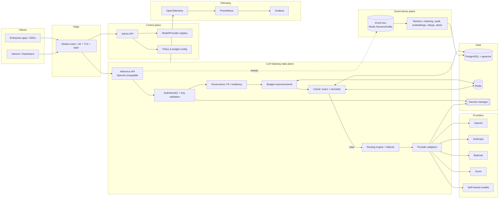
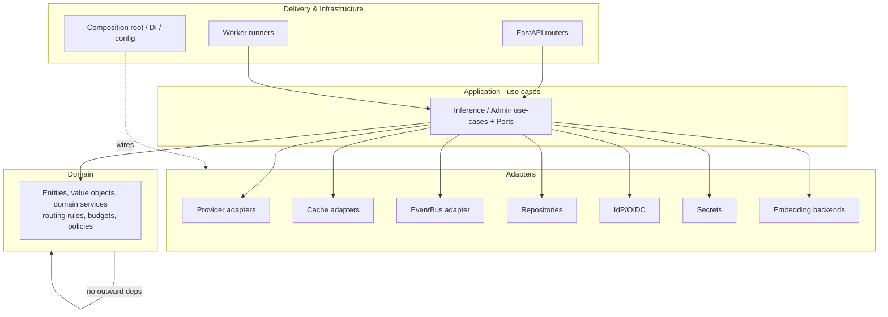

# System Architecture

**Product:** Enterprise LLM Gateway & Cost Router
**Phase:** 2 — Architecture · Draft for approval
**Last updated:** 2026-07-15

This is the master architecture document. It states the high-level design and every subsystem, and
links to the diagram packages ([C4](architecture/C4/), [sequence](architecture/sequence/),
[deployment](architecture/deployment/), [data-flow](architecture/data-flow/),
[security](architecture/security/)) and to the [ADRs](adr/) that justify each decision. All decisions
trace back to Phase 1 requirements ([FR](Functional_Requirements.md), [NFR](Non_Functional_Requirements.md),
[Risks](Risks.md), [Traceability](Traceability_Matrix.md)).

## Contents
1. Architectural principles
2. High-level system architecture
3. Layered (Clean/Hexagonal) structure
4. Runtime components & processes
5. Multi-tenant architecture
6. Authentication architecture
7. Authorization (RBAC) architecture
8. Provider abstraction layer
9. Intelligent routing engine
10. Cost optimization & budget enforcement
11. Semantic cache architecture
12. Prompt management architecture
13. Model registry architecture
14. Event-driven & background-worker architecture
15. Database architecture (PostgreSQL + pgvector)
16. Redis architecture
17. Observability, logging & monitoring
18. Secrets management
19. Security architecture & trust boundaries
20. High availability, DR & horizontal scaling
21. Deployment architectures (SaaS & self-hosted)
22. Requirement → architecture coverage

---

## 1. Architectural principles

- **Clean/Hexagonal architecture** — domain independent of frameworks and providers; everything
  external is a **port + adapter** ([ADR-0001](adr/0001-clean-architecture-and-runtime.md)). *(NFR-M01/M02)*
- **One codebase, two deployment modes** — SaaS vs self-hosted differ only by configuration resolved
  at the composition root ([ADR-0011](adr/0011-self-hosted-deployment-architecture.md)). *(NFR-D01)*
- **Security & governance are first-class**, enforced at the gateway and biased to **fail closed** for
  integrity controls ([ADR-0009](adr/0009-fail-open-fail-closed-matrix.md)). *(NFR-SEC/C)*
- **Hot path is async and thin**; accounting, audit, and analytics are **event-driven and off-path**
  ([ADR-0005](adr/0005-eventing-backbone.md)). *(NFR-P01/P06)*
- **Everything observable** — metrics, traces, structured logs per request. *(NFR-O)*
- **Extensible by default** — providers, routing strategies, cache/embedding backends, and event bus
  are swappable adapters. *(NFR-M02)*

## 2. High-level system architecture

The **data plane** serves inference with a thin, ordered pipeline (authenticate → govern → reserve
budget → cache → route → call provider). The **control plane** manages configuration (providers,
models, policies, budgets, keys). The **async plane** handles durable accounting, audit, embeddings,
analytics, and alerts off the hot path. See the [C4 container diagram](architecture/C4/02-container.md).

## 3. Layered (Clean/Hexagonal) structure — [ADR-0001](adr/0001-clean-architecture-and-runtime.md)

Dependencies point **inward**; the domain has no framework/provider imports. The composition root is
the **only** place deployment-mode and backend choices are wired, keeping the two deployment modes and
all pluggable backends out of business logic. *(NFR-M01/M02, NFR-D01)*

## 4. Runtime components & processes — [ADR-0001](adr/0001-clean-architecture-and-runtime.md), [ADR-0005](adr/0005-eventing-backbone.md)

| Process | Responsibility | Scaling signal |
|---------|----------------|----------------|
| **API service** (ASGI/FastAPI) | Inference + admin HTTP/SSE; hot path | RPS / CPU |
| **Worker: metering** | Consume `usage.recorded` → ledger writes, reconcile Redis | event lag |
| **Worker: audit** | Consume `audit.event` → immutable audit store | event lag |
| **Worker: embeddings** | Consume `cache.embed_requested` → embed + upsert vectors | queue depth |
| **Worker: analytics** | Roll up usage/cost aggregates | schedule |
| **Worker: alerts** | Budget thresholds, SLO burn → notifications | event lag |
| **Scheduler/reconciler** | Budget resets, Redis↔ledger reconciliation, health probes | cron |

All processes are **stateless** (state in Postgres/Redis) and **horizontally scalable** (NFR-S02),
built from **one image**, selected by role/config.

## 5. Multi-tenant architecture — [ADR-0002](adr/0002-multi-tenant-isolation-model.md)

**Shared schema + `tenant_id` on every tenant-owned row + PostgreSQL Row-Level Security** as a
database-enforced backstop, layered under application-level tenant scoping (defense in depth). Tenant
context is established at the edge from the authenticated principal/virtual key, propagated through the
use-case boundary, and bound to the DB session so RLS filters automatically; **deny-by-default** if
absent. Hierarchy: **Tenant → Team → Member / Virtual Key** (FR-130..138). Noisy-neighbor isolation
(NFR-S06) comes from per-tenant quotas/rate limits, not DB partitioning. Self-host = exactly one
tenant, same code. *(FR-130..138, NFR-SEC07, NFR-S03/S06, RISK-T05)*

## 6. Authentication architecture — [ADR-0008](adr/0008-rbac-model.md)

Two principal types:

- **Human admins** → **OAuth2/OIDC** against the enterprise IdP (Okta/Azure AD/Google); the gateway
  issues short-lived **JWTs** with refresh, validates signatures via JWKS, and supports **key rotation
  and revocation** (FR-090..093). JWT carries subject, tenant, roles.
- **Applications** → **virtual API keys** issued per tenant/team, presented as bearer credentials;
  **only hashed** key material is stored (show-once at creation), with rotation/revocation/expiry
  (FR-094..097). Keys carry **scopes** (inference-only subset).

AuthN failures **fail closed** (401/403) — [ADR-0009](adr/0009-fail-open-fail-closed-matrix.md) row 6.
See [sequence: auth](architecture/sequence/05-auth-oidc-rbac.md). *(FR-090..097, NFR-SEC01/04/05)*

## 7. Authorization (RBAC) architecture — [ADR-0008](adr/0008-rbac-model.md)

Central **`AuthorizationPort`** with one policy-decision function used by **both API and UI** (FR-128).
Roles (`owner, admin, operator, finance, auditor, developer`) map to a **fine-grained permission
catalog**; a decision = *principal's role, within resource's tenant/team scope, grants the required
permission?* **Deny-by-default, least-privilege** (FR-099/100); every sensitive decision is **audited**
(FR-101). Virtual-key **scopes** are an inference-only subset and never grant admin permissions. The
role→permission matrix is in [ADR-0008](adr/0008-rbac-model.md). Future ABAC/policy-engine can back the
same port. *(FR-098..101, FR-128/129, NFR-SEC05)*

## 8. Provider abstraction layer — [ADR-0003](adr/0003-provider-abstraction-strategy.md)

First-party **`LLMProviderPort` + adapter per provider** (Strategy pattern) resolved via the **Provider
Registry**. Each adapter maps request/response/stream/error/usage to a **canonical internal model** and
**normalized error taxonomy** (enabling uniform failover). A **generic OpenAI-compatible adapter**
covers self-hosted/open-weight models. Providers/models are **enabled/disabled at runtime** via the
registry (no redeploy). **Contract tests** replay recorded fixtures to catch provider drift (RISK-T04).
See [C4 component diagram](architecture/C4/03-component.md). *(FR-020..029, NFR-M02, NFR-A02)*

## 9. Intelligent routing engine — [ADR-0012](adr/0012-intelligent-routing-engine.md)

A **composable strategy pipeline**:
**Eligibility filter** (policy + **residency** + enable-state + capability; fails closed if empty) →
**Ranking strategy** (`lowest_cost | lowest_latency | quality_tier | weighted | pinned`, using live
price tables + latency/health) → **Decision record** (candidate set, choice, reason → trace) →
**Bounded failover execution** (ordered attempts within max-attempts/latency budget, honoring
**circuit breakers**) → optional **right-sizing / fallback chains / canary**. Strategies implement
`RoutingStrategyPort` (open/closed). Health/circuit state is maintained from passive signals + active
probes. See [sequence: failover](architecture/sequence/02-failover.md). *(FR-030..041, FR-116/117,
NFR-P01, NFR-A02)*

## 10. Cost optimization & budget enforcement — [ADR-0004](adr/0004-reserve-commit-cost-accounting.md)

**Reserve → Commit/Release** two-phase model:

1. **Reserve (sync, ≤5 ms):** estimate max cost (`max_tokens`×price); **atomic Redis Lua** decrement at
   the **most-restrictive** scope (key→team→tenant); insufficient ⇒ reject `budget_exceeded` **before**
   any provider call (fail closed). *(FR-060..063, NFR-P05)*
2. **Call provider** (via routing).
3. **Commit (async):** compute **actual** cost from returned usage; write the **append-only double-entry
   ledger** in PostgreSQL (system of record); reconcile the reservation. *(FR-070..073, NFR-P06)*
4. **Release** on failure/timeout.

Cost-optimization levers: **semantic/exact cache** (avoid calls) + **routing right-sizing** (cheapest
model meeting quality) → target ≥25% net savings (NFR-COST01, SM-P01). A **reconciler** repairs Redis
from the ledger and handles period resets. See [sequence: budget](architecture/sequence/03-budget-reserve-commit.md).
*(FR-060..077, NFR-P05/P06/S05, SM-P06 zero overspend, RISK-T03)*

## 11. Semantic cache architecture — [ADR-0006](adr/0006-semantic-cache-architecture.md), [ADR-0007](adr/0007-embedding-strategy.md)

**Two tiers, tenant-scoped:**
- **Exact** — normalized-request hash → response in **Redis** (sub-ms), per-policy TTL.
- **Semantic** — on exact miss, for cacheable low-variance requests: embed prompt (**`EmbeddingProvider`
  port**, local model by default) → **`pgvector` HNSW** similarity search **within tenant partition** →
  hit only above per-policy **threshold**, recording **score + source id** (auditable).

High-temperature/opt-out requests **bypass** cache (FR-053). Invalidation via TTL, manual purge,
model/version change (FR-058). Embedding **population is async** (event bus); lookup is gated to protect
the ≤40 ms budget. Semantic cache is instantly disable-able per tenant and off by default in air-gapped
installs without a local embedder. See [sequence: semantic cache](architecture/sequence/04-semantic-cache.md).
*(FR-050..058, NFR-P02/P03, NFR-COST03, RISK-T02)*

## 12. Prompt management architecture

The gateway is **not** a prompt IDE, but it manages prompt-adjacent concerns on the request path:
**normalization** (canonicalize messages/params for cache keying and hashing), **templating hooks**
(optional named server-side prompt templates/versions a tenant can reference by id, versioned for
cache-invalidation correctness), **PII pre-processing** (redaction before provider/embedding — ties to
governance), and **logging policy** (store / hash / drop prompt+response per tenant policy, FR-118).
Prompt/template versions participate in cache keys so a template change invalidates stale entries
(FR-058). Full prompt-template lifecycle (authoring UI) is a **future extension**, not v1 scope
([PRD](PRD.md) non-goals). *(FR-118, FR-058, FR-110..112)*

## 13. Model registry architecture — [ADR-0003](adr/0003-provider-abstraction-strategy.md)

Authoritative catalog of **providers**, **models**, and their metadata: capability (chat/embed/stream),
context window, modality, **quality tier**, **versioned price tables with effective dates** (FR-021,
FR-074), region availability (feeds residency eligibility), and **enable/disable state** (runtime,
FR-028). The routing engine and cost engine read the registry; admins manage it via the control plane.
Price-table versioning underpins cost accuracy (SM-T07) and reproducible historical cost. *(FR-020/021,
FR-028, FR-074/075)*

## 14. Event-driven & background-worker architecture — [ADR-0005](adr/0005-eventing-backbone.md)

**`EventBus` port**; **Redis Streams** default adapter (both modes; air-gap-friendly), **Kafka/Redpanda**
adapter for high-scale SaaS. Producers publish **fire-and-forget** off the hot path; **workers**
consume via consumer groups with ack, retries, and a **dead-letter stream**. Consumers are
**idempotent** (dedupe by event id) so at-least-once delivery yields exactly-once *effects* (supports
FR-036). Event families: `usage.recorded`, `budget.threshold`, `audit.event`, `cache.embed_requested`,
`analytics.rollup`. See [worker table](#4-runtime-components--processes) and
[data-flow](architecture/data-flow/01-data-flow.md). *(FR-066/070-077/086-088/113, NFR-S05/P06/A05/D05)*

## 15. Database architecture — PostgreSQL + pgvector — [ADR-0002](adr/0002-multi-tenant-isolation-model.md), [ADR-0006](adr/0006-semantic-cache-architecture.md)

**PostgreSQL 16** is the system of record. Design tenets (detailed physical schema is Phase 3):

- **Tenancy:** `tenant_id` on every tenant-owned table + **RLS** policies; deny-by-default session.
- **Logical entities:** tenant, team, membership, user, virtual_key(+scopes), provider, model,
  price_table, routing_policy, budget, reservation(ref), **usage_ledger** (append-only double-entry),
  cache_entry(+vector), audit_event (append-only/hash-chained), governance_policy.
- **Vectors:** `pgvector` column on `cache_entry` with an **HNSW index**, tagged with
  `embedding_model/version/dimension`; queries constrained by `tenant_id` (isolation).
- **Write scaling:** the high-volume `usage_ledger` is **append-only**, written by workers in batches
  (NFR-S05); time-based **partitioning** for usage/audit; read replicas for analytics.
- **Integrity:** audit + ledger are **append-only**; migrations are single-path (shared schema).

See [PostgreSQL design in the data-flow doc](architecture/data-flow/01-data-flow.md). Physical schema,
ERD, and `Schema.sql` are **Phase 3**. *(FR-070..077, FR-113/114, FR-130..134, NFR-SEC02/09, NFR-S04/S05)*

## 16. Redis architecture — [ADR-0004](adr/0004-reserve-commit-cost-accounting.md), [ADR-0005](adr/0005-eventing-backbone.md), [ADR-0006](adr/0006-semantic-cache-architecture.md)

Redis 7+ serves **three roles**, logically separated (by keyspace/prefix, or dedicated instances at
scale):
1. **Budget counters** — atomic **Lua** reserve/commit (enforcement-critical; **fails closed** if down).
2. **Exact cache** — normalized-request hash → response, per-policy TTL.
3. **Event streams** — Redis Streams for the event bus (default backend).

Redis runs **HA (primary + replicas, automatic failover)**; persistence (AOF) sized to the RPO
(NFR-A05). Because budget enforcement depends on Redis, it is treated as a **critical dependency** with
HA and a fail-closed policy. *(FR-050..053, FR-060..065, NFR-P02/P05, NFR-A03/A05)*

## 17. Observability, logging & monitoring — Phases 10

- **Tracing:** **OpenTelemetry** spans across gateway→routing→provider, correlated by `x-request-id`;
  W3C `traceparent` accepted/propagated (FR-080/083).
- **Metrics:** **Prometheus** exposes the **four golden signals** + cache hit rate + cost + failover
  counts + per-provider share (FR-081/087/088); **Grafana** dashboards; **alerting** on SLO/error-budget
  burn (FR-085).
- **Logging:** **structured JSON**, request-id-correlated, **PII handled per policy** (store/hash/drop,
  FR-082/118).
- **SLOs:** defined with error budgets (NFR-O02); health/readiness/liveness endpoints on all services
  (NFR-O03); runbooks (NFR-O04).

Metering/analytics freshness ≤60 s (NFR-O05). See [observability data-flow](architecture/data-flow/01-data-flow.md).
*(FR-080..089, NFR-O01..O05)*

## 18. Secrets management — [ADR-0011](adr/0011-self-hosted-deployment-architecture.md)

**`SecretsProvider` port** with pluggable backends (cloud KMS/secret manager in SaaS; in-cluster
Vault/sealed-secrets for self-host). Provider credentials and signing keys are **never** in source or
DB plaintext (FR-022/097, NFR-SEC03); virtual keys stored **hashed** (FR-097). Startup **fails fast** if
secrets are unreachable ([ADR-0009](adr/0009-fail-open-fail-closed-matrix.md) row 16, FR-146). Signing
keys rotate with revocation (FR-093). *(FR-022, FR-093, FR-097, FR-146, NFR-SEC02/03, RISK-S04)*

## 19. Security architecture & trust boundaries — [security/](architecture/security/)

TLS 1.2+ in transit, AES-256 at rest (NFR-SEC01/02); WAF + rate limiting at the edge (FR-064/065,
NFR-SEC08); OWASP ASVS L2 baseline (NFR-SEC04); deny-by-default authZ (NFR-SEC05); tenant-isolation
tests (NFR-SEC07); tamper-evident **hash-chained audit** (FR-113/114, NFR-SEC09); **PII redaction** and
**data residency** at the gateway (FR-110..117), both **fail closed**. Trust boundaries and the full
**STRIDE threat model** are in [architecture/security/](architecture/security/02-threat-model-stride.md).
*(NFR-SEC01..09, NFR-C01..06)*

## 20. High availability, DR & horizontal scaling — [ADR-0010](adr/0010-multi-region-strategy.md)

- **HA:** stateless services replicated across **multi-AZ**; HA Postgres (primary+replicas) and HA
  Redis; no SPOF (NFR-A03).
- **Horizontal scaling:** stateless API/workers scale linearly to ≥50 replicas (NFR-S02) on RPS/queue
  signals; ≥5k RPS steady/10k burst per region (NFR-S01).
- **DR:** **cell-based, single-writer-per-tenant** regions; async cross-region replication (RPO ≤5 min)
  + documented promotion (RTO ≤30 min); per-tenant active-passive failover (NFR-A05).
- **Residency:** tenant pinned to a home region (NFR-C02).

See [deployment/SaaS](architecture/deployment/01-saas.md). *(NFR-A01..A06, NFR-S01/S02, NFR-C02)*

## 21. Deployment architectures

- **SaaS** — cell-per-region on Kubernetes, multi-AZ, global health/geo router, managed or in-cluster
  data stores. [deployment/01-saas.md](architecture/deployment/01-saas.md).
- **Self-hosted** — same images, **Helm chart**, single cell, `self_hosted` profile, air-gap-ready,
  data stays in-boundary, Helm rollback. [deployment/02-self-hosted.md](architecture/deployment/02-self-hosted.md).

Both from **one codebase** ([ADR-0011](adr/0011-self-hosted-deployment-architecture.md)). No application
or infrastructure code is produced in Phase 2. *(FR-140..146, NFR-D01..D05)*

## 22. Requirement → architecture coverage

Every PRD capability maps to a subsystem and ADR; the full matrix is in
[Architecture_Decision_Log.md](Architecture_Decision_Log.md) and validated in Phase-2 checks.

| PRD cap | Subsystem (§) | Primary ADR(s) |
|---------|---------------|----------------|
| PR-01 Unified API | §2,§4 | ADR-0001 |
| PR-02 Providers | §8,§13 | ADR-0003 |
| PR-03 Routing/failover | §9 | ADR-0012, ADR-0003 |
| PR-04 Caching | §11 | ADR-0006, ADR-0007 |
| PR-05 Budgets/quotas | §10 | ADR-0004 |
| PR-06 Metering | §10,§14 | ADR-0004, ADR-0005 |
| PR-07 Observability | §17 | ADR-0005 |
| PR-08 Auth/RBAC/keys | §6,§7 | ADR-0008 |
| PR-09 Governance | §12,§19 | ADR-0009 |
| PR-10 Dashboard | §7 (RBAC parity) | ADR-0008 |
| PR-11 Multi-tenancy | §5 | ADR-0002 |
| PR-12 Self-host | §21 | ADR-0011, ADR-0010 |

### 22.1 Requirement coverage notes & justified deferrals

All 117 functional requirements are addressed by a subsystem/ADR above. Six non-functional
requirements are **process- or GA-phase** in nature; their architectural enablement is noted here and
their verification is scheduled in later phases (nothing is orphaned):

| NFR | Nature | Architectural enablement | Verified in |
|-----|--------|--------------------------|-------------|
| NFR-C03 (retention/erasure, GDPR) | Data lifecycle | Append-only stores + tenant-scoped retention/purge hooks (FR-089/119); erasure via tenant/data deletion paths (§15) | Phase 9 |
| NFR-C04 (SOC2/ISO alignment) | Compliance program | Controls designed in (audit, RBAC, encryption, residency, isolation) map to control families | Phase 15 (GA) |
| NFR-C06 (DPA-friendly logging) | Configurable logging | Store/hash/drop logging policy per tenant (§17, FR-118) | Phase 9 |
| NFR-COST02 (infra $/1M req) | Cost budget | Stateless horizontal scaling + cache/routing efficiency (§10/§20); measured, not architected | Phase 13 |
| NFR-M05 (lint/format/type gates) | Tooling | Enforced in CI (ruff/black/mypy; eslint/prettier) | Phase 11 |
| NFR-UX02 (actionable API errors) | API design | Canonical error taxonomy + typed envelopes (§8, FR-009/010) | Phase 4 |
