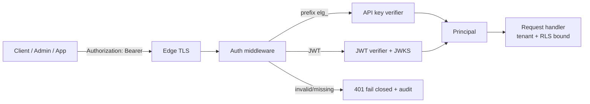
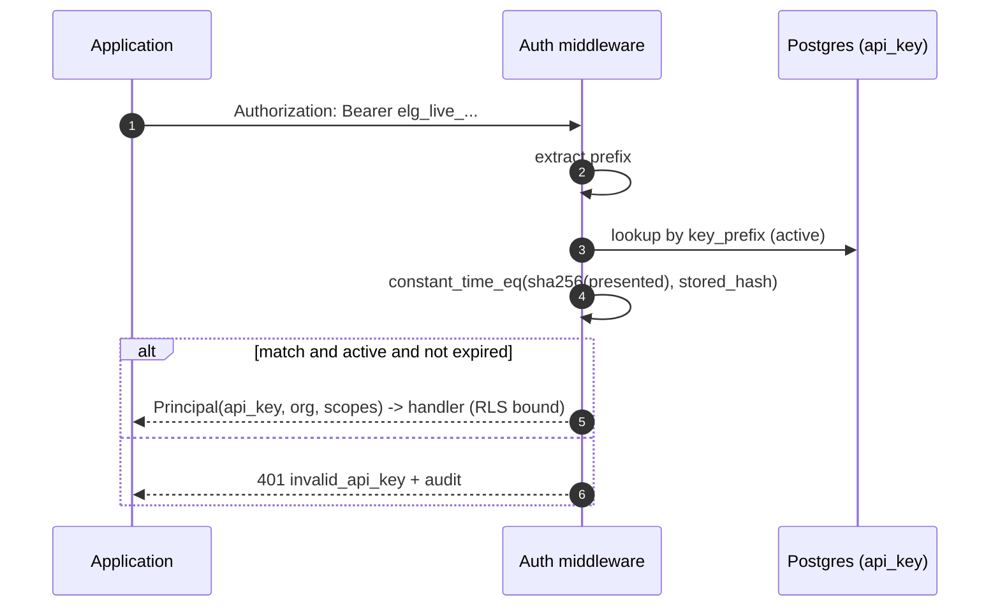
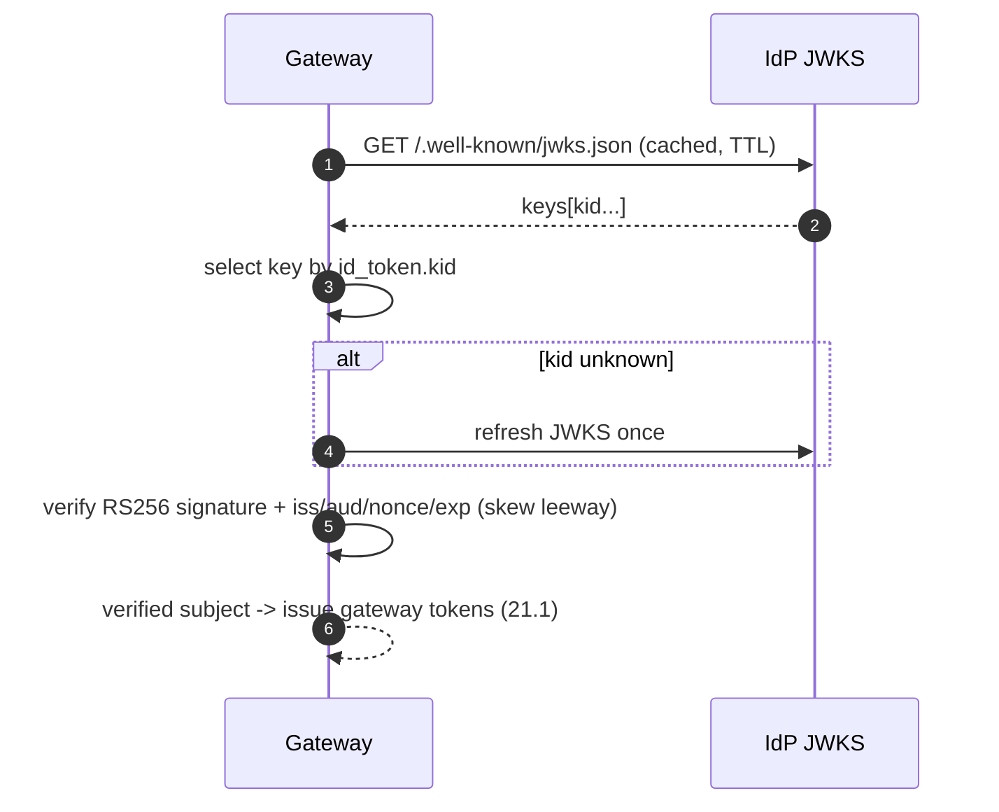
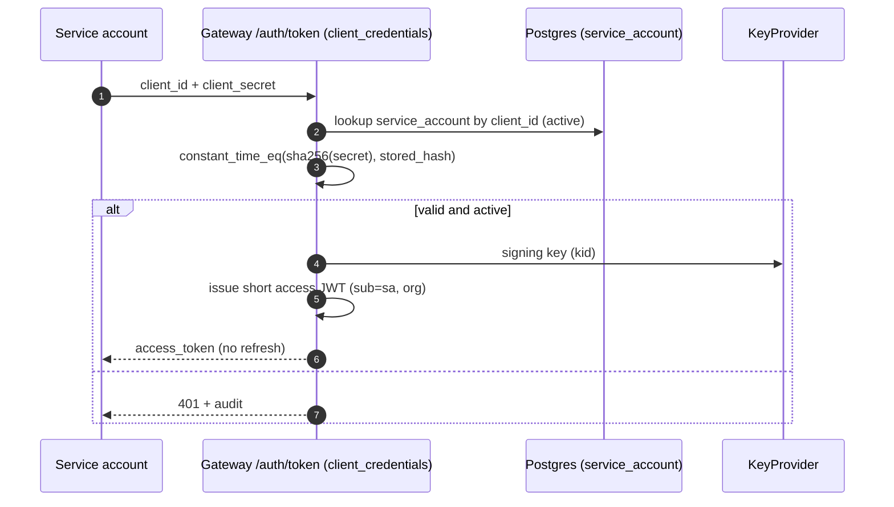
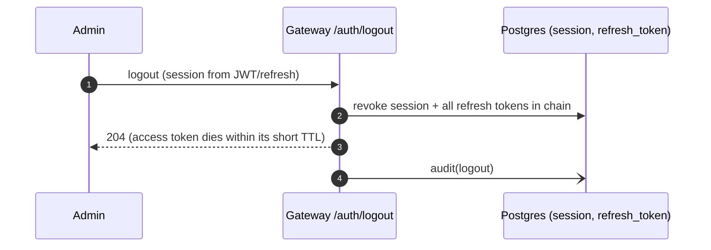
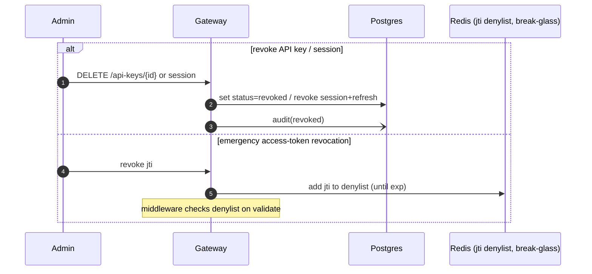

# Authentication Architecture

**Phase:** 5 — Backend (Milestone 3) · Design for approval
**Scope:** Authentication only. Authorization (RBAC) is Milestone 4. Realizes **ADR-0008**
(auth/keys), **ADR-0002** (tenant scoping), **ADR-0009** (fail-closed), **ADR-0011** (secret
references). Cross-refs: [API_Authentication](API_Authentication.md),
[STRIDE threat model](architecture/security/02-threat-model-stride.md),
[RLS_Strategy](RLS_Strategy.md), [Security_Traceability](Security_Traceability.md).

> Design principle: **authenticate at the edge, fail closed, never trust input, never store a
> recoverable secret.** Every credential is either asymmetric-signed (JWT) or stored only as a
> hash; the tenant is always derived from the credential, never from the request body.

## 1. Principals & credentials
| Principal | Credential | Purpose | Verification |
|-----------|-----------|---------|--------------|
| Human admin | OIDC → gateway **JWT** (RS256) + rotating **refresh token** | Control-plane access | JWT signature (local keys) / refresh hash lookup |
| Application | **Virtual API key** (`elg_<env>_<rand>`) | Inference | SHA-256 hash + constant-time compare |
| Service account | **Client credentials** (client_id + secret) → short JWT | Automation | secret hash + constant-time compare |

The tenant (`organization_id`) is embedded in the credential (JWT `org` claim, or the key/account
record) and drives RLS (ADR-0002). No credential grants cross-tenant access.

## 2. Authentication flow (high level)


## 3. Trust boundaries
- **Z0 Untrusted → Edge:** TLS 1.2+ terminates; only Bearer credentials cross (no cookies → minimal
  CSRF surface, §16).
- **Edge → Auth:** credentials validated before any business logic (deny-by-default).
- **Auth → Secrets:** signing private keys + IdP client secret fetched via `SecretsPort` (ADR-0011),
  never in DB/logs.
- **Auth → IdP:** OIDC over TLS; IdP JWKS validated; `iss`/`aud`/`nonce` checked.
See [trust boundaries](architecture/security/01-trust-boundaries.md).

## 4. JWT lifecycle
- **Algorithm:** **RS256** (asymmetric) so public keys are publishable via JWKS and services validate
  without the signing secret. **Algorithm agility:** an explicit allow-list (`{RS256}` now, `ES256`
  addable); `alg:none` and HMAC algs are **rejected** (prevents alg-confusion attacks).
- **Header:** `kid` selects the verification key (key rotation, §9).
- **Claims:** `iss` (gateway), `sub` (principal id), `org` (tenant), `typ` (`access`), `jti` (unique,
  replay), `scope` (key scopes; roles arrive in M4), `iat`, `nbf`, `exp`.
- **TTL:** short (default **10 min**) — limits blast radius of a leaked access token.
- **Validation:** signature (kid→key), `iss`/`aud`, `exp`/`nbf`/`iat` with **clock-skew leeway
  (default 60 s)**, `typ`. Any failure → `401` (fail closed, ADR-0009 row 6).

## 5. Access-token lifecycle
Issued at login/refresh, carried as `Authorization: Bearer`, validated statelessly on every request
(no DB hit — fast, NFR-P01). Not individually revocable by design (short TTL); an **emergency `jti`
denylist** (Redis, later) is documented as the break-glass path. Expiry → client refreshes (§6).

## 6. Refresh-token lifecycle
- **Opaque**, high-entropy (`secrets.token_urlsafe`), **stored only as SHA-256 hash** (`refresh_token.token_hash`).
- **Rotation on every use:** each refresh issues a new refresh token and marks the old one rotated
  (`rotated_to`). Longer TTL than access (e.g., days), bounded by session expiry.
- **Reuse detection (theft signal):** presenting an already-rotated/expired refresh token ⇒ the whole
  **session chain is revoked** and an audit event is raised. This defeats stolen-token replay.
- Bound to a **session** (§12).

## 7. Virtual API key lifecycle
- **Generation:** `elg_<env>_<32+ bytes url-safe random>`; a non-secret **prefix** (`elg_live_ab12`) is
  stored for display/lookup; the **full key is shown once**.
- **Storage:** only **SHA-256(key)** in `api_key.key_hash` (fast hash is safe — keys are high-entropy,
  not human passwords).
- **Verification:** lookup by prefix → **constant-time** compare of `SHA-256(presented)` vs stored
  (`hmac.compare_digest`) → check status/expiry/scope. Failure → `401`.
- **Rotation/revocation:** `POST /api-keys/{id}/rotate` issues a new secret; `DELETE` revokes
  immediately (status `revoked`).

## 8. Service-account lifecycle
- A `service_account` holds a **client credential** (client_id + secret); the **secret is hashed**
  (SHA-256, constant-time verify) like an API key.
- **Client-credentials grant:** the account presents its secret → gateway issues a **short JWT**
  (`sub`=service_account id, `org`=tenant). No refresh token (re-authenticate with the secret).
- Lifecycle: create → active → disabled; secret rotation supported; disabling blocks new tokens
  immediately.

## 9. OAuth / OIDC flow (human login)
- **Authorization Code + PKCE** against the enterprise IdP. Gateway generates `state` + `nonce` +
  PKCE `code_verifier`; the IdP returns a `code`; gateway exchanges it (with `code_verifier`) for the
  IdP `id_token`.
- **id_token verification:** signature via the **IdP JWKS** (cached, kid-selected), plus `iss`/`aud`/
  `exp`/`nonce`. On success the gateway maps `iss+sub` → `oauth_identity` → `app_user` and issues its
  **own** access+refresh (never forwards the IdP token downstream).
- `state` (CSRF for the redirect) and `nonce` (replay) are single-use and validated.

## 10. JWKS strategy
- The gateway **publishes its public keys** at `/.well-known/jwks.json` as a JWKS set (each key with a
  `kid`, `use:sig`, `alg:RS256`).
- During rotation the set contains the **current + previous** public keys so tokens signed by the
  outgoing key still validate until they expire.
- For **inbound OIDC**, the gateway **consumes the IdP's JWKS** (fetched over TLS, cached with TTL,
  refreshed on unknown `kid`) to verify id_tokens — the same JWT verifier, different key source.

## 11. Key rotation strategy
- **Signing keys** (RSA) are provisioned/stored via `SecretsPort` (ADR-0011); each has a `kid`.
- **Rotation:** generate a new keypair (new `kid`), mark it **current** for signing; retain the prior
  **public** key in JWKS for a grace window ≥ max access-token TTL; then retire it.
- **Private-key handling:** loaded into memory only as needed; retired private key material is
  **zeroized** (bytearray wipe) where the runtime permits.
- **Revocation of a key** (compromise): remove from JWKS immediately → all tokens with that `kid` fail
  closed; force re-login.

## 12. Session & device management
- A **session** = one login instance; stores `user_id`, `ip`, `user_agent`, `created_at`, `expires_at`,
  and is the **parent of the refresh-token chain**.
- **Logout** revokes the session and its refresh tokens. Users can **list active sessions** and
  **revoke a specific device/session** (per-session revocation).
- Access tokens are stateless; session revocation stops **refresh**, so access dies within its short
  TTL.

## 13. Secret storage strategy
- **Never store recoverable secrets.** Signing **private keys** and the **IdP client secret** live in
  the secrets manager (`SecretsPort`), referenced by `secret_reference` (ADR-0011, NFR-SEC03).
- **API keys / refresh tokens / service-account secrets:** stored only as **SHA-256 hashes**.
- **No secret in logs:** the logging redaction filter (M1) drops `authorization`/`token`/`secret`/
  `key_hash`/`cookie` keys.

## 14. Password hashing strategy
**Not applicable in v1** — human authentication is delegated to the enterprise IdP via OIDC, so the
gateway stores **no passwords**. If a local password path is ever introduced, it will use **Argon2id**
(memory-hard) with per-user salts — documented here, not implemented.

## 15. Replay-attack prevention
- **JWT:** short `exp` + unique `jti`; optional `jti` denylist for break-glass.
- **Refresh:** one-time-use rotation + **reuse detection** revokes the chain.
- **OIDC:** single-use `state` + `nonce` + PKCE.
- **API keys:** bearer secrets protected by **TLS**; misuse bounded by rotation + rate limits (FR-064).

## 16. CSRF considerations
The API is **bearer-token, not cookie-based**, so classic CSRF does not apply (no ambient credential
the browser auto-sends). The OIDC redirect uses a single-use **`state`** parameter (CSRF protection for
the login callback). If a future cookie-based session is added, it will use `SameSite=Strict` +
anti-CSRF tokens.

## 17. Token-binding considerations
v1 uses **bearer tokens over TLS**. **Sender-constrained tokens** (DPoP or mTLS-bound, RFC 8705/9449)
are documented as a future hardening to bind a token to a client key so a stolen token cannot be
replayed by another client — deferred, tracked for a future ADR.

## 18. Authentication failure modes (all fail closed — ADR-0009 row 6)
| Condition | Result |
|-----------|--------|
| Missing/blank credential | `401 authentication_error` |
| Malformed JWT / bad signature / `alg:none` / alg-confusion | `401 invalid_token` |
| Unknown `kid` | `401 invalid_token` |
| Expired access token | `401 token_expired` |
| Not-yet-valid (`nbf`) beyond skew | `401 invalid_token` |
| Revoked/rotated refresh token reuse | `401` + **session revoked** + audit |
| Unknown/revoked/expired API key | `401 invalid_api_key` |
| Disabled service account | `401` |
| IdP/JWKS unreachable | `401` (cannot verify → deny) |
| Signing-key store unreachable at startup | **fail-fast** (process refuses to start, FR-146) |

## 19. Security assumptions
TLS terminates untrusted traffic; the secrets manager and IdP are trusted; server clocks are
reasonably synchronized (bounded by skew leeway); RS256/SHA-256 are cryptographically sound for the
threat model; the DB enforces RLS (ADR-0002).

## 20. Threat mitigations (STRIDE)
| Threat | Mitigation |
|--------|-----------|
| **Spoofing** | RS256 signatures; JWKS/kid; API-key + service-account hashing; OIDC verification |
| **Tampering** | Signed JWTs; hashed stored secrets; TLS |
| **Repudiation** | Structured **audit events** for every auth outcome (correlation id) |
| **Information disclosure** | No recoverable secrets stored; log redaction; constant-time compare (no timing leak) |
| **Denial of service** | Stateless JWT validation; rate limits (FR-064); bounded JWKS fetch/cache |
| **Elevation of privilege** | Deny-by-default; key scopes; short TTL; RBAC in M4 |

---

## 21. Sequence diagrams

### 21.1 Login (OIDC authorization-code + PKCE → gateway tokens)
```mermaid
sequenceDiagram
    autonumber
    participant U as Admin (browser)
    participant GW as Gateway /auth
    participant IdP as OIDC IdP
    participant KP as KeyProvider (SecretsPort)
    participant DB as Postgres (session, refresh_token, oauth_identity)
    U->>GW: start login
    GW->>GW: create state + nonce + PKCE verifier
    GW-->>U: redirect to IdP (code_challenge, state, nonce)
    U->>IdP: authenticate
    IdP-->>U: redirect back (code, state)
    U->>GW: /auth/token (code, state)
    GW->>GW: verify state (single-use)
    GW->>IdP: exchange code + code_verifier
    IdP-->>GW: id_token
    GW->>IdP: JWKS (cached)
    GW->>GW: verify id_token (sig, iss, aud, nonce, exp)
    GW->>DB: map iss+sub -> oauth_identity -> app_user; create session
    GW->>KP: current signing key (kid)
    GW->>GW: issue access JWT + refresh token (store hash)
    GW-->>U: access_token + refresh_token
```

### 21.2 Token refresh (rotation + reuse detection)
```mermaid
sequenceDiagram
    autonumber
    participant C as Client
    participant GW as Gateway /auth/refresh
    participant DB as Postgres (refresh_token, session)
    C->>GW: refresh_token
    GW->>DB: lookup SHA-256(token)
    alt not found / rotated / expired
        GW->>DB: revoke session chain (theft signal)
        GW-->>C: 401 + audit(reuse_detected)
    else valid
        GW->>DB: mark old rotated_to = new; store new hash
        GW->>GW: issue new access JWT + new refresh
        GW-->>C: new access_token + refresh_token
    end
```

### 21.3 API-key authentication


### 21.4 OAuth login (delegated) — see 21.1; id_token verification detail


### 21.5 Service-account authentication (client credentials)


### 21.6 Logout


### 21.7 Key rotation
```mermaid
sequenceDiagram
    autonumber
    participant Op as Scheduler/Operator
    participant KP as KeyProvider (SecretsPort)
    participant JWKS as JWKS endpoint
    Op->>KP: generate new RSA keypair (new kid)
    KP->>KP: set new key = current (signing)
    KP->>JWKS: publish {current + previous} public keys
    Note over KP: sign new tokens with new kid;<br/>old public key validates until old tokens expire
    Op->>KP: after grace window, retire old key
    KP->>KP: zeroize retired private key bytes
    KP->>JWKS: drop retired public key
```

### 21.8 Revocation


## 22. Requirements traceability
FR-090..097 (auth, keys, sessions, rotation), FR-101/113 (audit), FR-128/129 (tenant scope);
NFR-SEC01/03/04/05/09, NFR-P01 (stateless JWT); ADR-0008/0002/0009/0011. Control-level mapping in
[Security_Traceability.md](Security_Traceability.md).
