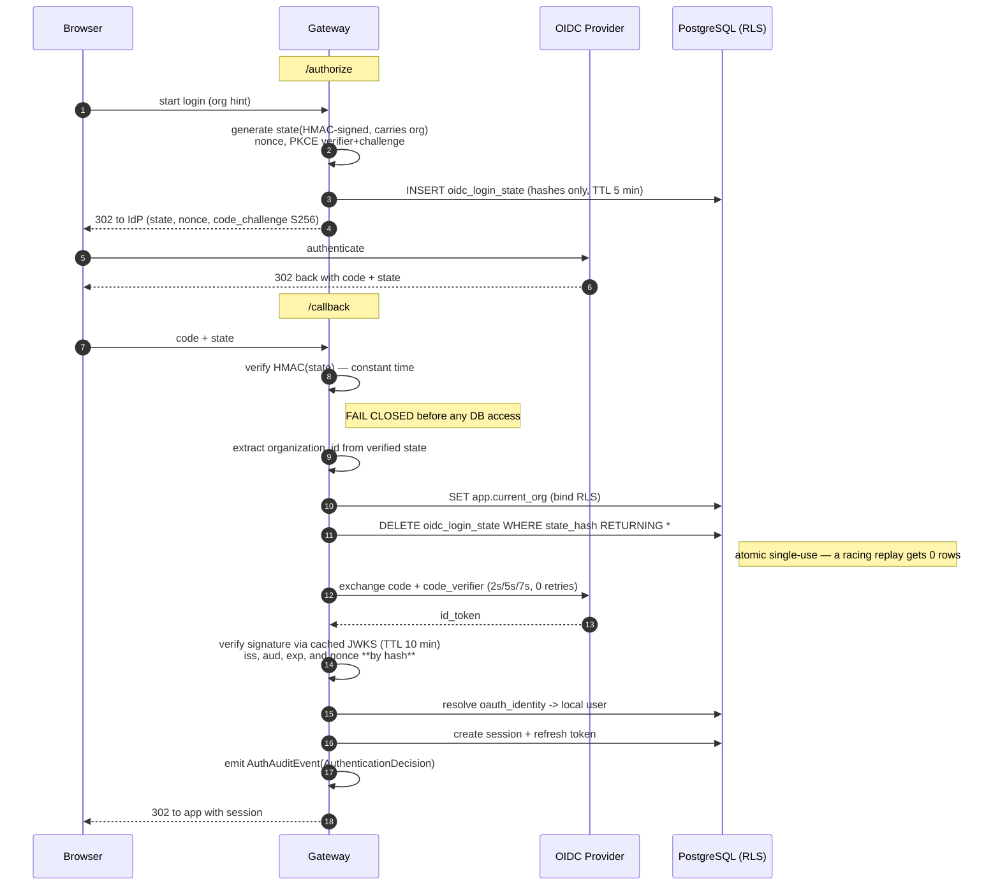

# Authentication Data Flow

**Phase:** 5 — Backend · Milestone 3d-2B
**Last updated:** 2026-07-18
**Related:** [Authentication_Architecture.md](Authentication_Architecture.md) ·
[Cryptographic_Architecture.md](Cryptographic_Architecture.md) ·
[ADR-0014](adr/0014-runtime-database-role-rls-enforcement.md) ·
[ADR-0015](adr/0015-oidc-login-state-storage.md)

How a credential becomes an `AuthenticationContext`, for every supported flow. **Order is a
security property, not an implementation detail** — each diagram's sequence is the contract.

## 1. Canonical OIDC login (authorization code + PKCE)

The defining property: **nothing is trusted, and the database is never touched, until the
`state` HMAC verifies.** Tenant context is bound only after the org is authenticated, which is
what keeps the RLS-scoped `oidc_login_state` row reachable without a bypass path.



**Failure behaviour at each step** (all fail closed, all audited with an `AuthenticationDecision`):

| Step | Failure | Result |
|---|---|---|
| verify HMAC(state) | forged/tampered/malformed | reject; **no DB access, no IdP call** |
| consume state | unknown / expired / already used | reject as replay (`INVALID_TOKEN`) |
| consume state | concurrent duplicate callback | exactly one winner; loser rejected |
| exchange code | timeout / transport / no id_token | reject; `oidc_token_exchange_failures_total` |
| verify id_token | bad sig, iss, aud, exp, `alg` | reject (`INVALID_TOKEN`) |
| verify id_token | unknown `kid` | refresh JWKS once; still unknown ⇒ reject |
| verify nonce | mismatch | reject as replay |
| resolve identity | no linked local user | reject; **no partial login** |

## 2. Bearer credential on an API request (JWT / API key)

```mermaid
sequenceDiagram
    autonumber
    participant C as Client
    participant MW as AuthenticationMiddleware
    participant A as Authenticator
    participant DB as PostgreSQL (RLS)

    C->>MW: Authorization: Bearer <credential>
    alt no header
        MW-->>C: pass through (public route)
    else malformed header
        MW-->>C: 401 (audited, timed)
    end
    MW->>A: authenticate(credential)
    alt JWT
        A->>A: verify RS256 sig, kid, iss, aud, exp (+skew)
    else API key (gw_ prefix)
        A->>DB: lookup by non-secret prefix
        A->>A: SHA-256 + constant-time compare
    end
    alt success
        A-->>MW: Principal
        MW->>MW: attach ONE AuthenticationContext to request.state.auth
        MW->>MW: observe gateway_auth_duration_seconds{method,result=success}
        MW-->>C: continue
    else failure
        MW->>MW: observe {result=failure}; audit AuthenticationDecision
        MW-->>C: 401 fail closed
    end
```

## 3. Trust boundaries and what crosses them

| Boundary | Crosses inward | Verified before use |
|---|---|---|
| Browser → Gateway | `code`, `state` | `state` HMAC (before anything else) |
| IdP → Gateway | `id_token` | signature via JWKS, iss/aud/exp, nonce-by-hash |
| Gateway → PostgreSQL | tenant context | RLS enforced as `app_rw` (never BYPASSRLS) |
| Client → Gateway | bearer credential | signature or hashed-secret compare |

## 4. What is persisted, and in what form

| Value | Stored as | Why |
|---|---|---|
| `state` (random half) | SHA-256 | lookup key; raw value never stored |
| `nonce` | SHA-256 | compared by hash at verification |
| `code_verifier` | **plaintext**, ≤5 min | protocol requires the original at exchange (ADR-0015) |
| API key | SHA-256 + non-secret prefix | prefix locates the row, hash verifies |
| refresh token | SHA-256 | rotation + reuse detection |
| signing keys | key provider / secrets manager | never in the database |

No raw credential, token, verifier, or secret is ever written to logs, audit events, metric
labels, or error bodies.
