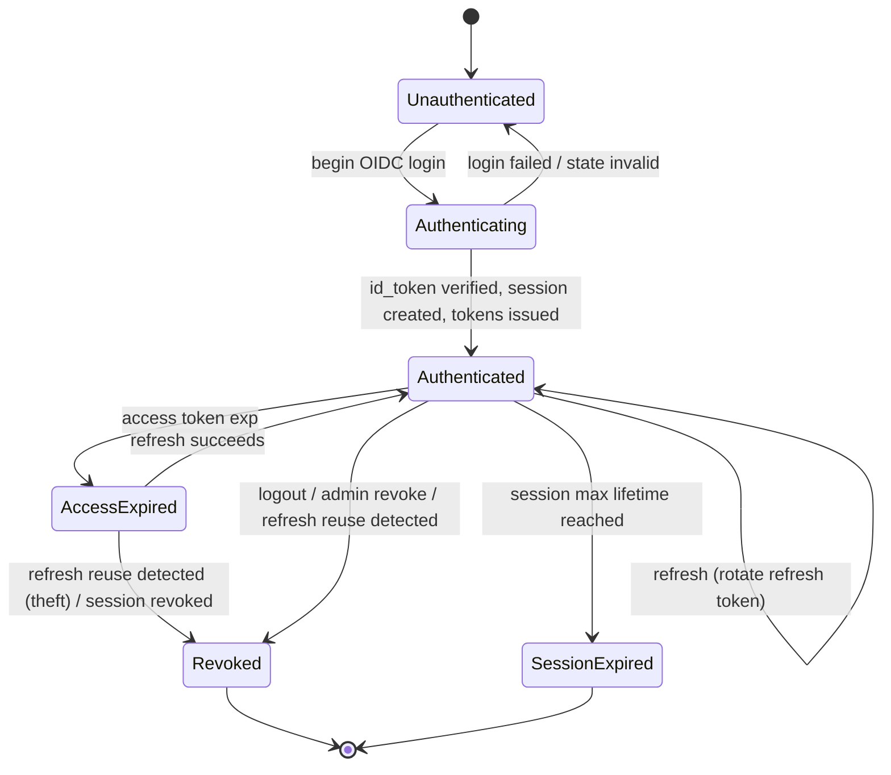
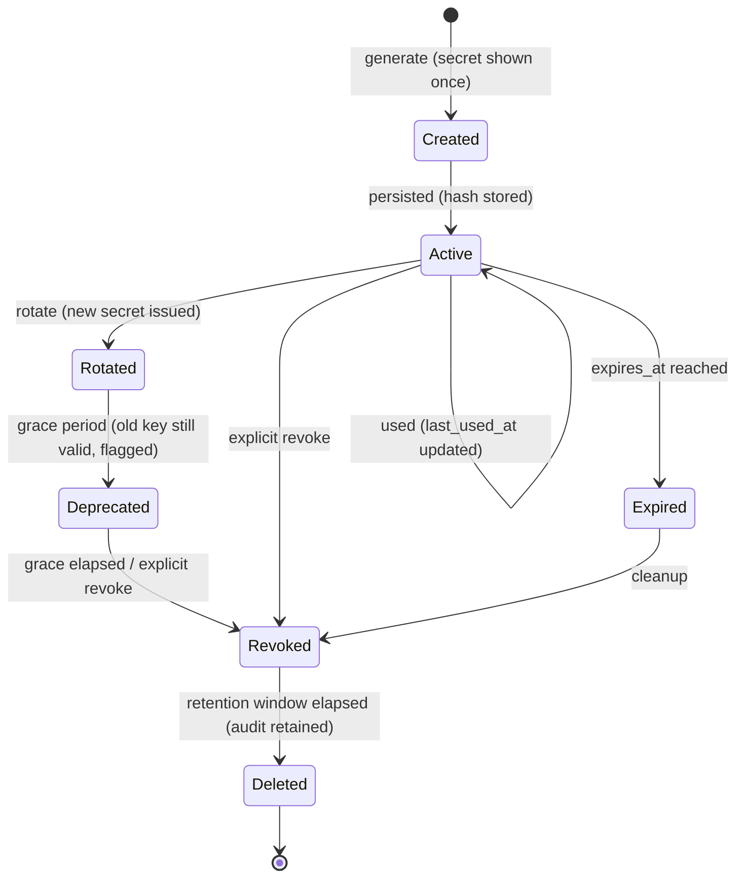

# Authentication State Machines

**Phase:** 5 — Backend (Milestone 3) · Design for approval
**Scope:** Formalizes the state transitions behind [Authentication_Architecture.md](Authentication_Architecture.md)
and [Cryptographic_Architecture.md](Cryptographic_Architecture.md). Introduces **no new behavior** — it
makes the legal transitions explicit so implementation and tests can assert them (state machines catch
edge cases sequence diagrams miss). Realizes ADR-0008.

## 1. Authenticated-session lifecycle
A **session** is a login instance (parent of the refresh-token chain). Access tokens are short-lived and
stateless; the session governs refresh.

**Transition rules**
- `Authenticating → Authenticated` requires a verified IdP `id_token` (sig, `iss`, `aud`, `nonce`) and a
  single-use `state`.
- `Authenticated → Authenticated (refresh)` **rotates** the refresh token (old marked `rotated_to`).
- **Refresh reuse** (a rotated/expired refresh token presented) forces `→ Revoked` for the whole session
  (theft signal) and emits an audit event.
- `Revoked`/`SessionExpired` are terminal; the client must re-authenticate.
- Access tokens are never individually revoked (short TTL); emergency `jti` denylist is the break-glass
  path.

## 2. Virtual API key lifecycle

**Transition rules**
- `Created → Active`: only the SHA-256 hash + non-secret prefix are stored; the full secret is returned
  once and never again (FR-097).
- `Active → Rotated`: a new key is issued; the caller migrates. `Rotated → Deprecated` keeps the old key
  valid for a short grace window (flagged) to avoid outage, then `→ Revoked`.
- `Active → Revoked` is immediate on explicit revoke (verification fails at once).
- `Expired` follows `expires_at`; `Revoked/Expired` keys never authenticate.
- `Revoked → Deleted` occurs after the retention window; the **audit trail of the key's lifecycle is
  retained** even after deletion.

## 3. Service-account credential lifecycle (summary)
`Created → Active → (SecretRotated → Active) → Disabled → Deleted`. A disabled account cannot obtain
tokens immediately; secret rotation issues a new hashed secret (old invalid at once). Mirrors the API-key
rules without a refresh token (re-authenticate with the client secret).

## 4. Why state machines
They make illegal transitions **testable**: e.g., a `Revoked` session must never reach `Authenticated`; a
`Rotated` refresh token presented again must go to `Revoked`; an `Expired` API key must never
authenticate. The Milestone-3 test suite asserts each terminal/illegal transition.

## 5. Traceability
ADR-0008; FR-090..097; NFR-SEC05/SEC09. Narrative + sequences:
[Authentication_Architecture.md](Authentication_Architecture.md); controls:
[Security_Traceability.md](Security_Traceability.md).
