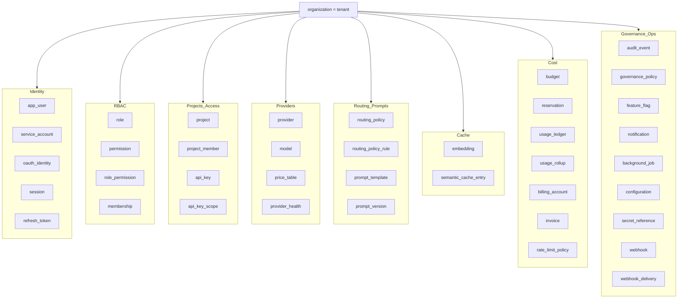
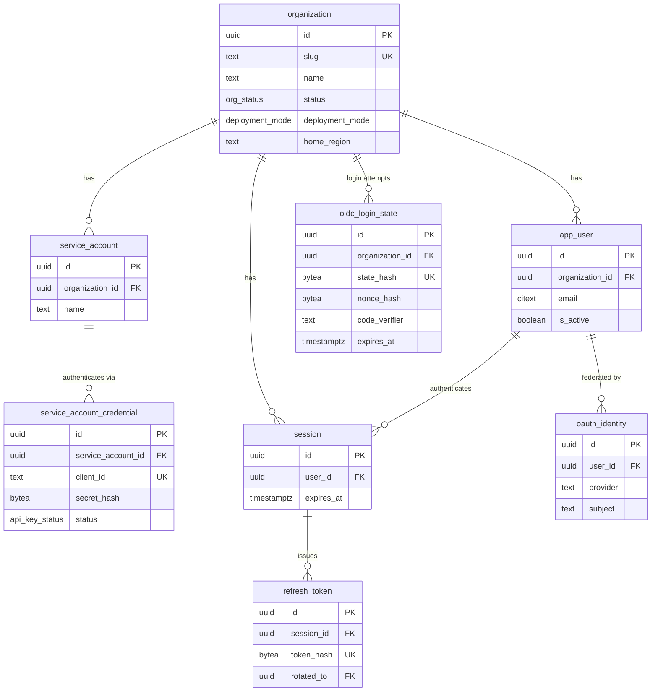
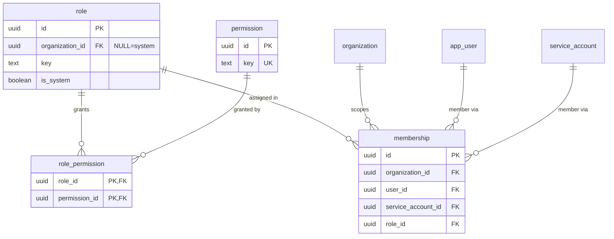
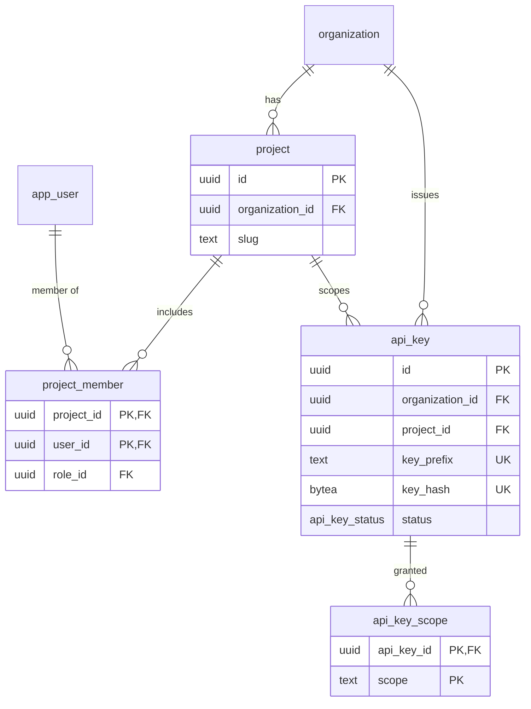
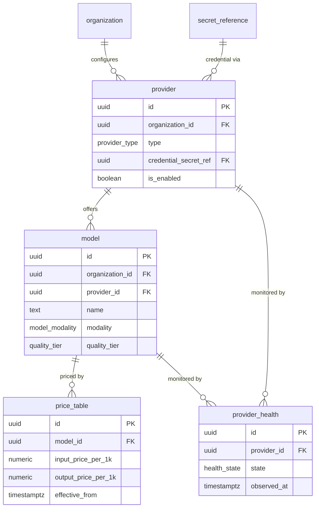
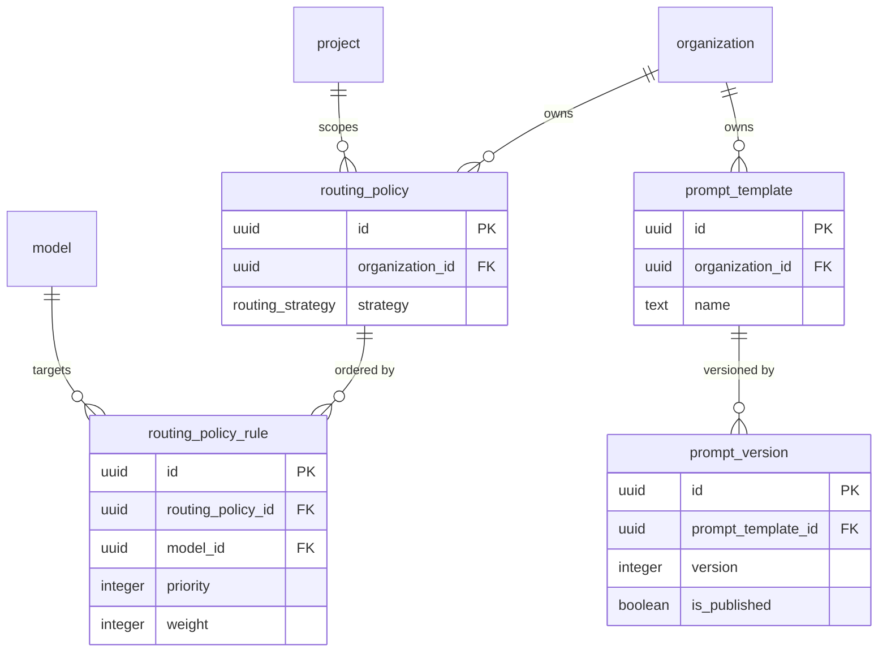
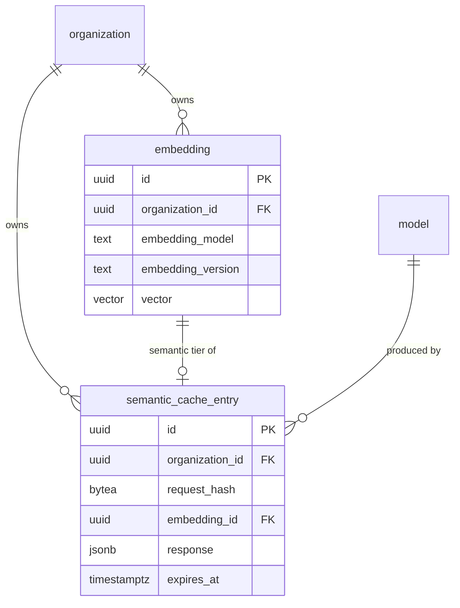
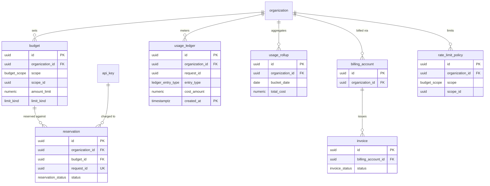
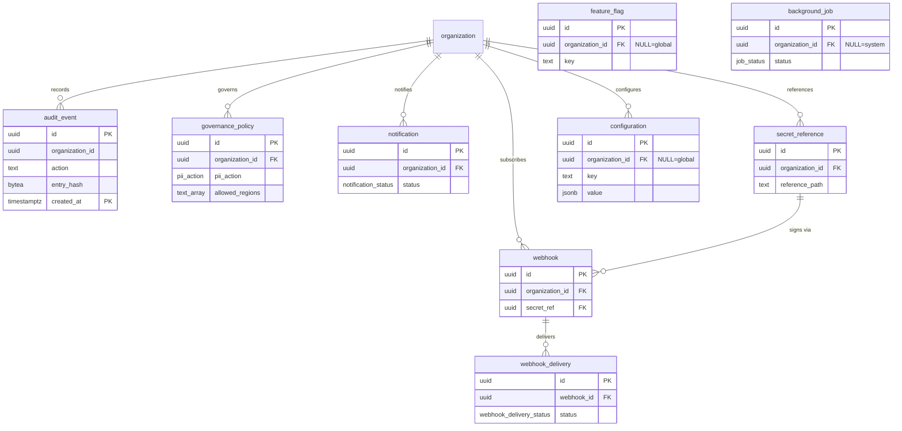

# Entity-Relationship Diagram (ERD)

**Phase:** 3 — Database Architecture · Draft for approval
**Last updated:** 2026-07-15

Mermaid `erDiagram`s for all **41 tables**, split by domain for readability, plus a high-level overview
and an explicit list of many-to-many relationships. Canonical DDL: [`Schema.sql`](Schema.sql); details:
[`Data_Dictionary.md`](Data_Dictionary.md). Crow's-foot: `||--o{` = one-to-many, `}o--o{` = many-to-many
(via association table).

## 0. High-level domain overview

## 1. Tenancy & Identity

## 2. RBAC

## 3. Projects & Access

## 4. Providers, Models & Registry

## 5. Routing & Prompts

## 6. Cache & Embeddings

## 7. Cost, Ledger, Usage & Billing

## 8. Governance & Ops

## 9. Many-to-many relationships (explicit)

| M2M | Left | Right | Association table | Extra attributes |
|-----|------|-------|-------------------|------------------|
| Role grants | `role` | `permission` | `role_permission` | — |
| Org membership | `app_user` / `service_account` | `organization` | `membership` | `role_id`, `status` |
| Project membership | `app_user` | `project` | `project_member` | `role_id` |
| Key scopes | `api_key` | scope (value) | `api_key_scope` | — |
| Policy candidates | `routing_policy` | `model` | `routing_policy_rule` | `priority`, `weight`, `condition` |

All other relationships are one-to-many (or one-to-one optional for `embedding`↔`semantic_cache_entry`).

## 10. Global (non-tenant-scoped) reference entities
`permission` (catalog), system `role` (NULL org), and NULL-org rows of `feature_flag` /
`configuration` are **global reference data** (not tenant-owned) and intentionally have no
`organization_id` requirement. `audit_event` carries `organization_id` but its FK is enforced
logically (append-only partitioned log) — see [`Database_Design.md`](Database_Design.md) §13 and
[`RLS_Strategy.md`](RLS_Strategy.md).
