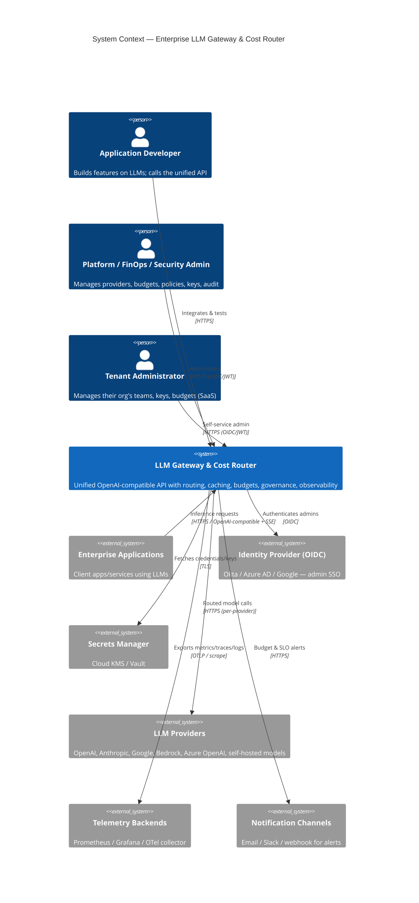

# C4 — Level 1: System Context

**Scope:** The Enterprise LLM Gateway & Cost Router as a black box among its users and external systems.
Back to [Architecture](../../Architecture.md) · [C4 index](README.md).

## Notes
- The gateway is the **single integration point** for client apps (FR-001..010) — apps change only base
  URL + key (AC-US-001).
- In **self-hosted/air-gapped** mode, external systems collapse into the customer boundary: IdP, secrets,
  and telemetry are in-cluster, and providers are restricted to an approved egress allow-list
  ([ADR-0011](../../adr/0011-self-hosted-deployment-architecture.md), FR-142/143).
- Trust boundaries over this context are detailed in
  [security/trust-boundaries](../security/01-trust-boundaries.md).

**Requirements:** FR-001..010, FR-090..093, FR-140..143; NFR-D05, NFR-C05.
