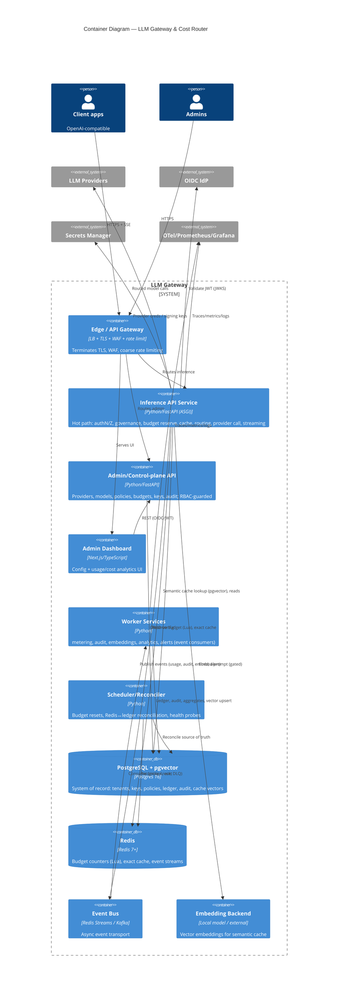

# C4 — Level 2: Containers

**Scope:** The deployable/runnable units inside the gateway and their interactions.
Back to [Architecture](../../Architecture.md) · [C4 index](README.md).

## Container responsibilities

| Container | Responsibility | Key ADR / FR |
|-----------|----------------|--------------|
| Edge / API Gateway | TLS, WAF, coarse rate limiting, routing to services | NFR-SEC01/08, FR-065 |
| Inference API | The hot path pipeline (§2 Architecture) | ADR-0001/0004/0006/0012 |
| Admin/Control-plane API | Configuration + RBAC-guarded management | ADR-0008, FR-120..129 |
| Admin Dashboard | Next.js UI, same RBAC as API | FR-120..129, NFR-UX01 |
| Workers | Off-path metering/audit/embeddings/analytics/alerts | ADR-0005, FR-070..088/113 |
| Scheduler/Reconciler | Budget resets, reconciliation, probes | ADR-0004, FR-069 |
| PostgreSQL+pgvector | System of record + vectors | ADR-0002/0006 |
| Redis | Counters + exact cache + streams | ADR-0004/0005/0006 |
| Event Bus | Async transport (pluggable) | ADR-0005 |
| Embedding backend | Vectors (local default) | ADR-0007 |

All compute containers are built from **one image**, stateless, horizontally scalable (NFR-S02). In
self-hosted mode the external systems and data stores run **in-cluster**
([ADR-0011](../../adr/0011-self-hosted-deployment-architecture.md)).

**Requirements:** FR-001..146 (distributed across containers); NFR-P*, NFR-S*, NFR-A*, NFR-D*.
