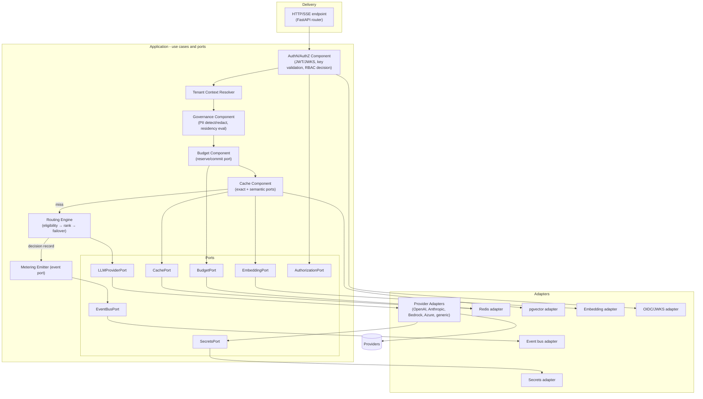

# C4 — Level 3: Components (Inference API Service)

**Scope:** Components inside the **Inference API Service** — the hot path. Other containers (workers,
admin API) have analogous internal decompositions.
Back to [Architecture](../../Architecture.md) · [C4 index](README.md).

## Component responsibilities & requirements

| Component | Responsibility | ADR | FR / NFR |
|-----------|----------------|-----|----------|
| AuthN/AuthZ | Validate JWT/key; RBAC decision (deny-by-default) | 0008 | FR-090..101; NFR-SEC05 |
| Tenant Context Resolver | Establish + bind tenant scope (RLS session) | 0002 | FR-130..132; NFR-SEC07 |
| Governance | PII detect/redact, residency eligibility (fail closed) | 0009 | FR-110..117 |
| Budget | Reserve (sync Lua) → commit/release | 0004 | FR-060..069; NFR-P05 |
| Cache | Exact (Redis) then semantic (pgvector), tenant-scoped | 0006/0007 | FR-050..058; NFR-P02/P03 |
| Routing Engine | Eligibility → rank → bounded failover + decision record | 0012 | FR-030..041; NFR-P01/A02 |
| Provider Adapters | Canonical map + normalized errors + usage | 0003 | FR-020..029 |
| Metering Emitter | Publish `usage.recorded` (non-blocking) | 0004/0005 | FR-070..073; NFR-P06 |
| Ports (interfaces) | Invert dependencies; enable swap/test | 0001 | NFR-M01/M02 |

The **dependency rule** holds: Delivery → Application → Domain; adapters implement Application **ports**
and are wired in the composition root only. This is what makes providers/cache/embedding/event-bus
swappable and the domain unit-testable without I/O.

**Requirements:** FR-020..117 (hot path), NFR-M01/M02, NFR-P01..P06, NFR-SEC05/07.
