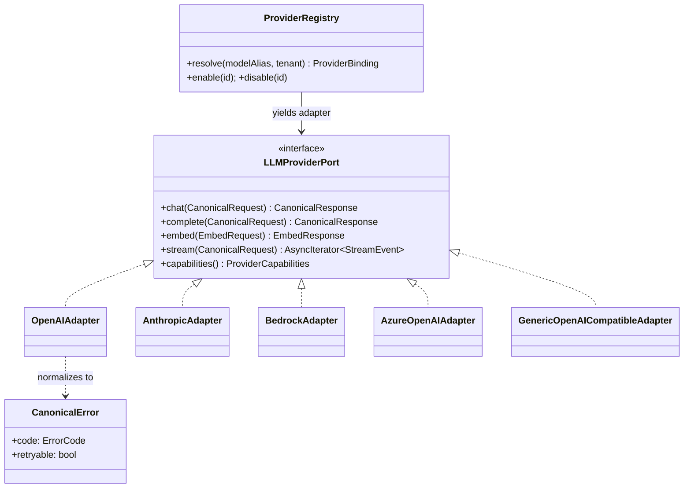
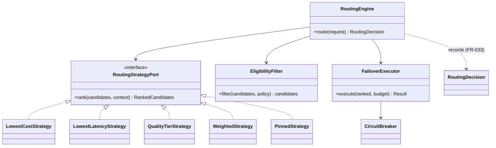
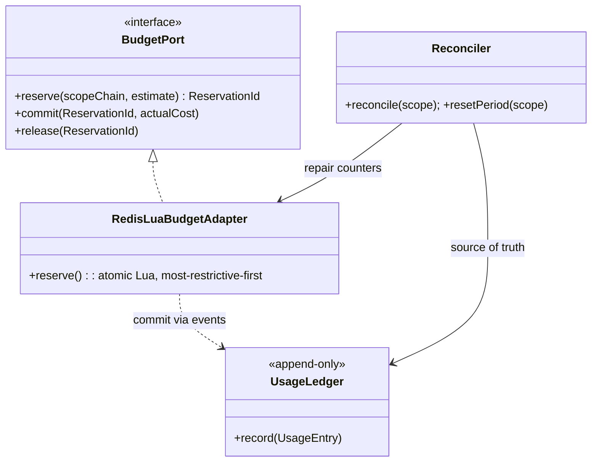

# C4 — Level 4: Code (illustrative, key abstractions)

**Scope:** The most important *design-level* abstractions and their relationships. This is a **design**
sketch (interfaces/contracts), **not implementation** — no code is produced in Phase 2. It illustrates
the Ports & Adapters seams that Phases 4–7 will implement.
Back to [Architecture](../../Architecture.md) · [C4 index](README.md).

## Provider abstraction (ADR-0003)

## Routing engine (ADR-0012)

## Budget reserve/commit (ADR-0004)

## Notes
- These interfaces are **contracts**, finalized in Phase 4 (API/domain models) and implemented in
  Phases 5–9. Method signatures shown are indicative.
- Every `*Port` is an Application-layer interface; every `*Adapter` lives in the Adapters layer and is
  wired in the composition root ([ADR-0001](../../adr/0001-clean-architecture-and-runtime.md)).

**Requirements:** FR-020..041, FR-060..063; NFR-M02.
