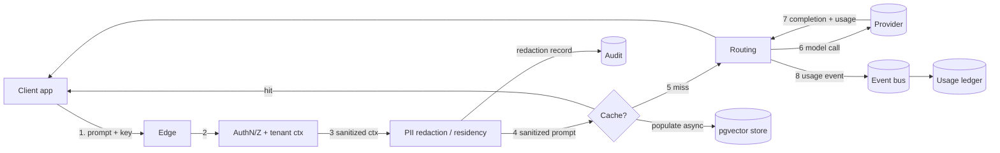

# Data Flow Diagrams

How data moves through the system, classified by sensitivity, on the request path and the async path.
Back to [Architecture](../../Architecture.md).

## 1. Inference request data flow (DFD level-1)

## 2. Data classification & handling

| Data | Classification | At rest | In transit | Retention / handling |
|------|----------------|---------|-----------|----------------------|
| Prompt / completion content | **Sensitive** (may contain PII) | AES-256; **store/hash/drop per policy** (FR-118) | TLS 1.2+ | Per-tenant logging policy; PII redacted pre-provider (FR-110-112) |
| Virtual API keys | **Secret** | **Hashed only** (FR-097) | TLS | Show-once; rotate/revoke |
| Provider credentials / signing keys | **Secret** | Secrets manager, never in DB (FR-022) | TLS | Rotated (FR-093) |
| Usage ledger (tokens, cost, ids) | Confidential | AES-256; append-only | TLS | System of record; retention policy (FR-089) |
| Audit events | Confidential | AES-256; **hash-chained append-only** | TLS | Tamper-evident; exportable (FR-113-115) |
| Cache vectors (embeddings) | Sensitive (derived) | AES-256; tenant-scoped + RLS | TLS | Invalidate on TTL/version (FR-058) |
| Config (providers, policies, budgets) | Confidential | AES-256 | TLS | Tenant-scoped |
| Metrics / traces | Internal (PII-scrubbed) | Per telemetry backend | TLS/OTLP | Retention per NFR-O; scrubbed (FR-082) |

## 3. Residency & boundary rules
- A tenant's **content, ledger, audit, and vectors** never leave its **home region** (SaaS) or the
  **customer boundary** (self-host) — [ADR-0010](../../adr/0010-multi-region-strategy.md)/[ADR-0011](../../adr/0011-self-hosted-deployment-architecture.md).
- Prompts sent to an **external embedder** are governed: forbidden by policy ⇒ local embedder or
  semantic-cache disabled ([ADR-0007](../../adr/0007-embedding-strategy.md)).
- Only **PII-scrubbed** telemetry crosses into observability backends (FR-082).

## 4. Observability data flow
`request → OTel spans + structured logs (request-id) → collector → Prometheus (metrics) / trace store →
Grafana (dashboards, alerts)`. Golden signals + cache/cost/failover metrics; SLO burn alerting
(FR-080..085).

**Requirements:** FR-082, FR-089, FR-110..118, FR-113..115, FR-022, FR-097; NFR-SEC01/02/09, NFR-C01..05.
