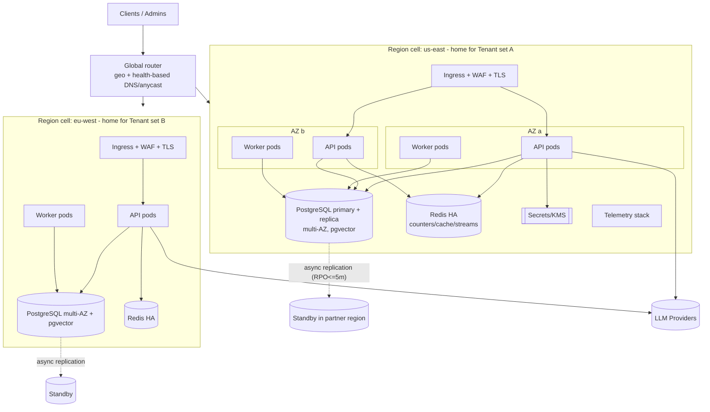

# Deployment — SaaS (cell-per-region, multi-AZ)

Multi-region **cells**, each self-contained; tenants pinned to a **home region** (residency); per-tenant
active-passive cross-region failover. Back to [index](README.md) ·
[ADR-0010](../../adr/0010-multi-region-strategy.md).

## Characteristics
- **HA:** stateless API/worker pods across **≥2 AZs**; HA Postgres + HA Redis; **no SPOF** (NFR-A03);
  HPA scales pods on RPS/queue depth to ≥50 replicas (NFR-S02) for ≥5k RPS steady/10k burst (NFR-S01).
- **Residency:** tenant data pinned to home-region cell (FR-116/117, NFR-C02); global router sends the
  tenant to its cell.
- **DR:** async cross-region replication (RPO ≤5 min) + documented promotion (RTO ≤30 min); **single
  writer per tenant** preserves budget atomicity ([ADR-0004](../../adr/0004-reserve-commit-cost-accounting.md)).
- **Scaling unit** is the **cell**: add regions/cells for growth and blast-radius containment.
- **Secrets** via cloud KMS/secret manager; **telemetry** to the regional OTel/Prom/Grafana stack.

**Requirements:** NFR-A01/A03/A05/A06, NFR-S01/S02, NFR-C02; FR-116/117.
