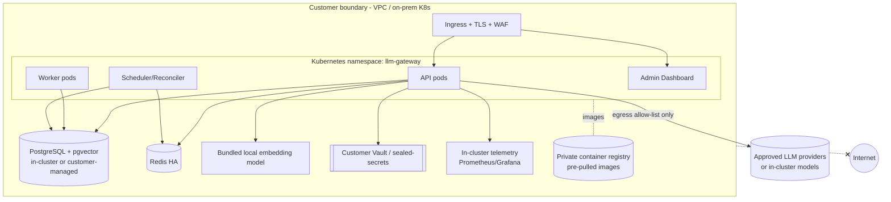

# Deployment — Self-hosted (single cell, air-gap-ready)

Same images, deployed by **Helm** into the customer's Kubernetes as a **single tenant cell**; all data
stays in the customer boundary. Back to [index](README.md) ·
[ADR-0011](../../adr/0011-self-hosted-deployment-architecture.md).

## Characteristics
- **One codebase, `self_hosted` profile:** multi-region off, external telemetry off by default, embedding
  = bundled local model (FR-140/141, NFR-D01).
- **Air-gap:** images pre-pulled to a **private registry**; **egress allow-list** limited to approved
  provider endpoints (or fully in-cluster models); **no data or telemetry leaves** the boundary unless
  explicitly configured (FR-142/143, NFR-C05, NFR-D05).
- **HA within one cluster:** replicated pods, HA Postgres/Redis (customer scale-dependent).
- **Ops:** reproducible via Helm/Terraform (NFR-D03); **startup fails fast** on misconfig (FR-146);
  health/readiness/liveness probes; **Helm rollback** for safe upgrades (FR-145, NFR-O04).
- **Secrets:** customer Vault/KMS/sealed-secrets via the `SecretsProvider` port (NFR-SEC03).

**Requirements:** FR-140..146; NFR-D01..D05, NFR-C05, NFR-O03/O04.
