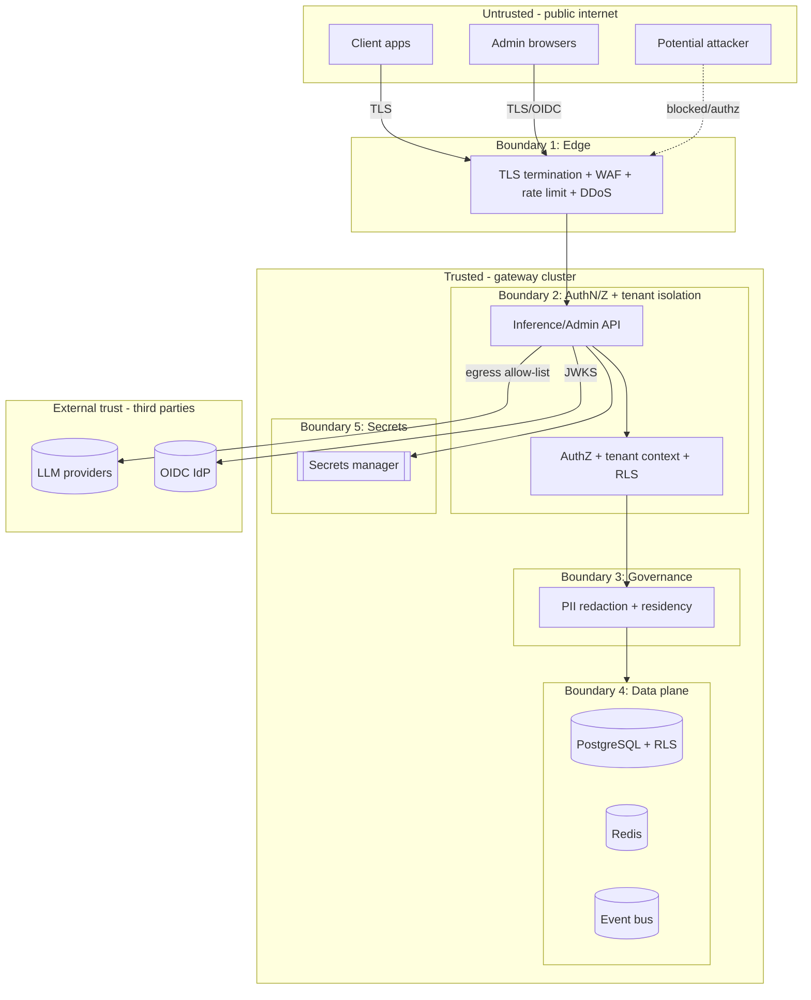

# Trust Boundary Diagram

Boundaries across which data crosses trust levels; each is a control point. Back to
[Architecture](../../Architecture.md) · [threat model](02-threat-model-stride.md).

## Boundaries & controls

| # | Boundary | Threats crossing | Primary controls | Refs |
|---|----------|------------------|------------------|------|
| 1 | Internet → Edge | DoS, injection, credential stuffing | TLS 1.2+, WAF, rate limiting, DDoS protection | NFR-SEC01/08, FR-065 |
| 2 | Edge → AuthN/Z + tenant | Spoofing, cross-tenant access, privilege escalation | OIDC/JWT, key hash validation, RBAC deny-by-default, tenant context + **RLS** | ADR-0002/0008, FR-090-101/130-132 |
| 3 | Request → Governance | Data exfiltration (PII), residency violation | PII redaction, residency eligibility, **fail closed** | ADR-0009, FR-110-117 |
| 4 | App → Data plane | Tampering, repudiation, leakage | AES-256 at rest, RLS, append-only hash-chained audit | NFR-SEC02/09, FR-113/114 |
| 5 | App → Secrets | Secret disclosure | Secrets manager, no plaintext, fail-fast startup | NFR-SEC03, FR-022/146 |
| Ext | Gateway → Providers/IdP | MITM, over-sharing | TLS, egress allow-list, minimized payloads, governed embeddings | ADR-0007/0011, FR-142 |

In **self-hosted/air-gapped** mode, the "External" zone is minimized to an approved provider allow-list;
IdP/secrets/telemetry are inside the customer boundary.

**Requirements:** NFR-SEC01..09, NFR-C01..05; FR-090..117, FR-130..132.
