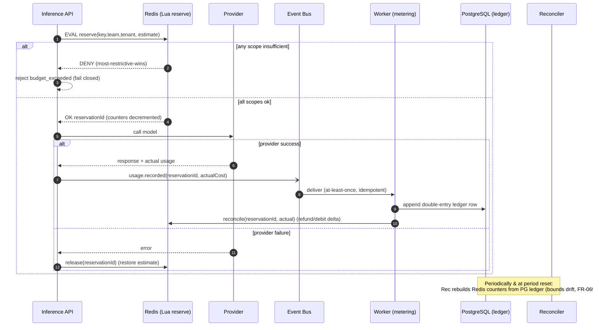

# Sequence — Budget reserve → commit / release

The two-phase cost-accounting flow that guarantees hard enforcement under concurrency without blocking
metering. Back to [index](README.md) · [ADR-0004](../../adr/0004-reserve-commit-cost-accounting.md).

## Notes
- **Reserve** decrements **most-restrictive-first** (key→team→tenant); a failure at any level denies
  (FR-062). Atomic Lua → correct under concurrency (FR-063, kills RISK-T03).
- **Estimate** is an upper bound (`max_tokens`×price); **commit** reconciles to actual → accurate ledger
  (SM-T07) without blocking the response (NFR-P06).
- If Redis is unavailable for a **hard-limited** scope, reserve **fails closed**
  ([ADR-0009](../../adr/0009-fail-open-fail-closed-matrix.md) row 1).
- The **ledger** (Postgres, append-only) is the system of record; Redis is a fast, reconstructable cache
  of counters.

**Requirements:** FR-060..063, FR-069, FR-070..073; NFR-P05/P06/S05; SM-P06.
