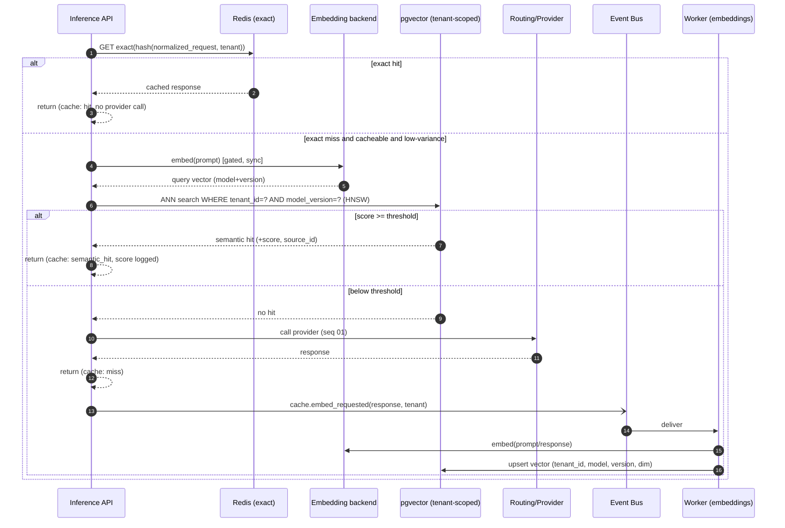

# Sequence — Semantic cache lookup & asynchronous population

Two-tier cache: exact (Redis) then semantic (pgvector), tenant-scoped; population is async. Back to
[index](README.md) · [ADR-0006](../../adr/0006-semantic-cache-architecture.md).

## Notes
- **Isolation:** every semantic query is constrained by `tenant_id` (+ RLS) → never cross-tenant
  (FR-057, [ADR-0002](../../adr/0002-multi-tenant-isolation-model.md)).
- **False-positive control:** hit requires score ≥ per-policy threshold; **score + source id** are
  logged for audit (FR-056), directly mitigating RISK-T02. Threshold and on/off are per-policy and
  instantly changeable.
- **Latency:** lookup embedding is **gated** to cacheable/low-variance requests to protect NFR-P03;
  population embedding is **async** (worker), off the hot path.
- **Invalidation:** TTL, manual purge, or `model/version` change (query filters by version so old-space
  vectors are never matched) — FR-058.
- **Air-gap:** uses the bundled local embedding model; if none and policy forbids external, semantic
  tier is disabled, exact tier still serves ([ADR-0007](../../adr/0007-embedding-strategy.md)).

**Requirements:** FR-050..058; NFR-P02/P03, NFR-COST03, NFR-SEC07.
