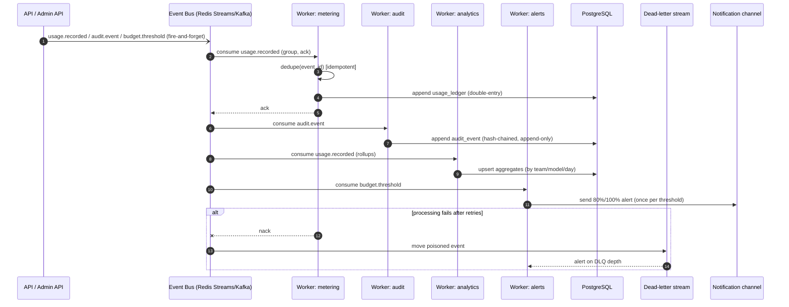

# Sequence — Asynchronous metering & audit pipeline

How off-path events become durable ledger/audit records and analytics, with at-least-once + idempotency.
Back to [index](README.md) · [ADR-0005](../../adr/0005-eventing-backbone.md).

## Notes
- **Non-blocking:** publishing never blocks the request (NFR-P06); durability of the stream protects
  RPO (NFR-A05).
- **At-least-once + idempotent consumers** (dedupe by `event_id`) → exactly-once *effects* (safe replay),
  supporting FR-036.
- **Ledger** and **audit** are **append-only**; audit is hash-chained (tamper-evident, FR-113/114,
  NFR-SEC09).
- **DLQ** captures poison events; depth is alerted. Metering/analytics freshness ≤60 s (NFR-O05).
- Backpressure/degradation per [ADR-0009](../../adr/0009-fail-open-fail-closed-matrix.md) rows 12/14 —
  preserve audit/usage, shed non-critical first.

**Requirements:** FR-066, FR-070..077, FR-086..088, FR-113/114; NFR-S05, NFR-P06, NFR-A05, NFR-O05.
